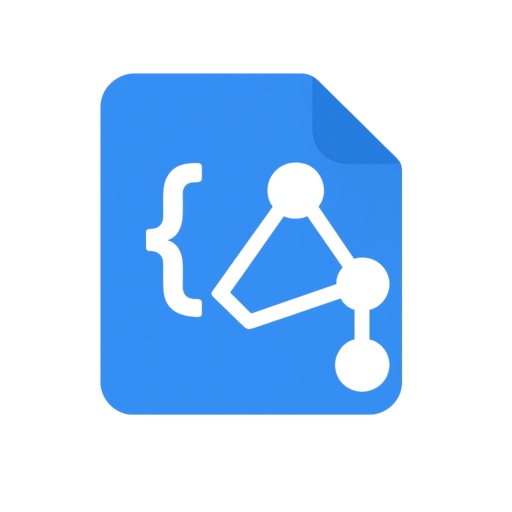

<h1 align="center">✨ <a href="https://json-schema-plus.abgox.com">json-schema-plus</a> ✨</h1>

<p align="center">
    <a href="https://github.com/abgox/json-schema-plus/blob/main/license">
        
    </a>
    <a href="https://github.com/abgox/json-schema-plus">
        
    </a>
    <a href="https://github.com/abgox/json-schema-plus">
        
    </a>
    <a href="https://github.com/abgox/json-schema-plus">
        
    </a>
    <a href="https://github.com/abgox/json-schema-plus">
        
    </a>
</p>

---

<p align="center">
  <strong>Star ⭐️ or <a href="https://abgox.com/donate">Donate 💰</a> if you like it!</strong>
</p>

[简体中文](./readme.zh-CN.md) | [English](./readme.md) | [Github](https://github.com/abgox/json-schema-plus) | [Gitee](https://gitee.com/abgox/json-schema-plus)



An extension for [Visual Studio Code](https://code.visualstudio.com/) that provides multilingual dynamic schema matching for JSON Schema.

> Also supports [VS Code for the Web](https://vscode.dev).

## What's New

See the [Changelog](./changelog.md) for details.

## How to Use

> [!Tip]
>
> Take `scoop-manifest.*.json` in [abgox/schema](https://schema.abgox.com) as an example.

1. [Install json-schema-plus](https://marketplace.visualstudio.com/items?itemName=abgox.json-schema-plus).

2. Add the following configuration to your [settings.json](https://code.visualstudio.com/docs/configure/settings) file.

   > [!Note]
   >
   > Refer to the configurations in [abgox/abyss](https://github.com/abgox/abyss/blob/main/.vscode/settings.json) or [abgox/PSCompletions](https://github.com/abgox/PSCompletions/blob/main/.vscode/settings.json) to use local schema files.

   ```json
   "json-schema-plus.schemas": [
      {
        "fileMatch": [
          "bucket/**/*.json"
        ],
        "url": "https://schema.abgox.com/scoop-manifest.en-US.json",
        "urls": [
          {
            "language": "zh",
            "url": "https://schema.abgox.com/scoop-manifest.zh-CN.json"
          },
        ]
      }
   ]
   ```

3. It will automatically load the corresponding schema architecture according to the current language environment.
   - If it is `zh-CN`.
     - It will match `zh` in `urls`.
     - Then it will load `https://schema.abgox.com/scoop-manifest.zh-CN.json`.
   - If it is `en-US`.
     - There is no relevant definition in `urls`.
     - Then it will load `https://schema.abgox.com/scoop-manifest.en-US.json`.

4. To ensure consistent environments, you may also need to set `.vscode/extensions.json`.

   ```json
   {
     "recommendations": ["abgox.json-schema-plus"]
   }
   ```
