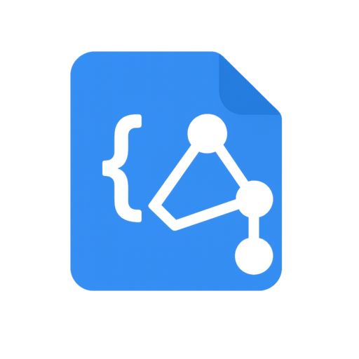

<h1 align="center">✨ <a href="https://json-schema-plus.abgox.com">json-schema-plus</a> ✨</h1>

<p align="center">
    <a href="https://github.com/abgox/json-schema-plus/blob/main/license">
        
    </a>
    <a href="https://github.com/abgox/json-schema-plus">
        
    </a>
    <a href="https://github.com/abgox/json-schema-plus">
        
    </a>
    <a href="https://github.com/abgox/json-schema-plus">
        
    </a>
    <a href="https://github.com/abgox/json-schema-plus">
        
    </a>
    <a href="https://marketplace.visualstudio.com/items?itemName=abgox.json-schema-plus">
        
    </a>
</p>

---

<p align="center">
  <strong>喜欢这个项目？请给它 Star ⭐️ 或 <a href="https://abgox.com/donate">赞赏 💰</a></strong>
</p>

[English](./readme.md) | [简体中文](./readme.zh-CN.md) | [Github](https://github.com/abgox/json-schema-plus) | [Gitee](https://gitee.com/abgox/json-schema-plus)



一个适用于 [Visual Studio Code](https://code.visualstudio.com/) 的扩展，它为 JSON Schema 提供了多语言的动态架构匹配

## 新的变化

请查阅 [更新日志](./changelog.zh-CN.md)

## 如何使用它

> [!Tip]
>
> 以 [abgox/schema](https://schema.abgox.com) 中的 `scoop-manifest.*.json` 为例

1. [安装 json-schema-plus](https://marketplace.visualstudio.com/items?itemName=abgox.json-schema-plus)

2. 添加以下配置到 [settings.json](https://code.visualstudio.com/docs/configure/settings) 中

   > [!Note]
   >
   > 如果使用本地 schema 文件，参考 [abgox/abyss](https://github.com/abgox/abyss/blob/main/.vscode/settings.json) 或 [abgox/PSCompletions](https://github.com/abgox/PSCompletions/blob/main/.vscode/settings.json)

   ```json
   "json-schema-plus.schemas": [
      {
        "fileMatch": ["bucket/**/*.json"],
        "urls": [
          {
            "language": "zh",
            "url": "https://schema.abgox.com/scoop-manifest.zh-CN.json"
          },
        ],
        "url": "https://schema.abgox.com/scoop-manifest.en-US.json"
      }
   ]
   ```

3. 它会根据当前的语言环境自动加载对应的 Schema 架构
   - 如果为 `zh-CN`
     - 它会匹配到 `urls` 中的 `zh`
     - 加载 `https://schema.abgox.com/scoop-manifest.zh-CN.json`
   - 如果为 `en-US`
     - 在 `urls` 中没有相关定义
     - 加载 `https://schema.abgox.com/scoop-manifest.en-US.json`
